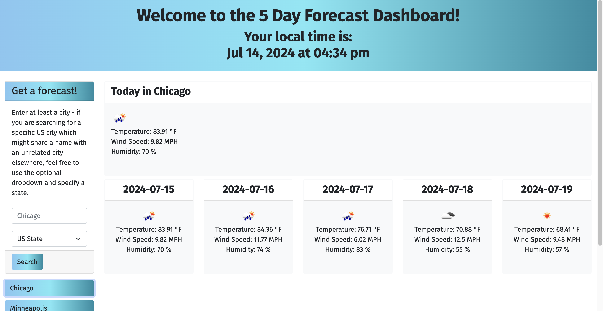

# Module 6 Challenge: Server-Side APIs - Weather Dashboard

This Homework assignment was completed for Unit Six of the U of M Bootcamp, to practice javascript server APIs, building out a dashboard to view drag-and-drop weather tiles. The complete code allows a user to input searches for a city and receive local weather information, both present and future (in a 5-day forcast). A built-in search history saves a clickable record of searching that particular city which allows the user to rerun that search, even if they have left the page.

## Link to Deployed Version
[Click here to view the deployed webpage.](https://floatingpoint-exaflop.github.io/weather-dashboard)

## Screenshot of Deployed Version

## Credits

Some starter code used and modified with permission for instructional purposes from U of M Bootcamp, Copyright 2024 edX.

Thanks to Eric Meyer for the [start.css](http://meyerweb.com/eric/tools/css/reset/) code.

Shoutout to [this blog post](https://www.seoptimer.com/blog/favicon-not-showing-up/) and [this tool](https://favicon.io/favicon-converter/) for the help with my favicon stuff.

I used's [OpenWeather's Geocoding API](https://openweathermap.org/api/geocoding-api) to retreive GPS data from specified cities.

I used's [OpenWeather's 5 Day Weather Forecast](https://openweathermap.org/forecast5) as my weather data API.

For reference on working with the OpenWeather API, I referenced a [Blog on API keys](https://coding-boot-camp.github.io/full-stack/apis/how-to-use-api-keys).

## License

Please refer to the LICENSE in the repo.